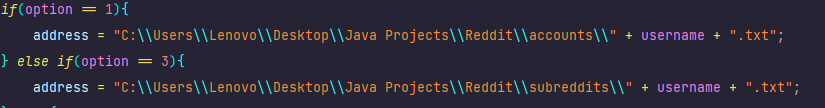
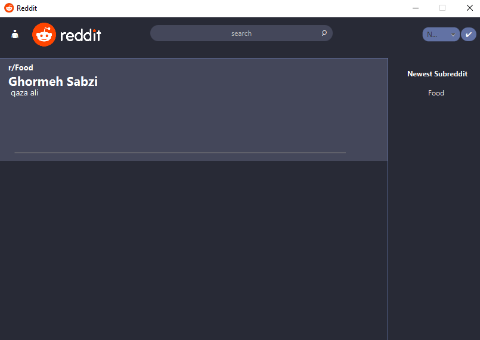

# Reddit (With JavaFX) ☜(ﾟヮﾟ☜)

Dive into anything. Reddit is a communicating app where people can post their ideas about anything.

## Description 📖

In Reddit there are different rules which I'm gonna explain them.
* **User**: You are the one who manage your own account. You can post on different, You can even have your own Subreddit.
* **Subreddit**: So what's subreddit then? It's like a community that has a specific topic where users can posts their ideas there.
* **Moderator**: The moderator can manage the subreddit he made. or he can make his member a moderator.

## Getting Started

### Dependencies 🍔

* If you want to use the JavaFX, You have to download Maven for your program.(gradle won't work for this)
* To use JavaFX you have to download it from [Gluon](https://gluonhq.com/products/javafx/).
* If you are not perfect at html and css you can use **SceneBuilder**.
* Having the Last version of java is recommended.

## Help 🚑
**This one is really important:**
1. go to Files Class
2. there are two method called `filewriter` and `fileReader`
3. you have to change the pathname of subreddit and account folder to your path.
4. if you don't do these above the code won't work
* 

## Executing program ▶

* Run the "Main" program.
* This method which is in Main is where the program starts with FX. So if you want to Change window you can do it here.
```
public void start(Stage stage) throws IOException {
        Parent root = FXMLLoader.load(Objects.requireNonNull(getClass().getResource("StartUP.fxml")));
        stage.setScene(new Scene(root));
        Image icon = new Image(Main.class.getResourceAsStream("icon.png"));
        stage.getIcons().add(icon);
        stage.setTitle("Reddit");
        stage.setResizable(false);
        stage.show();
}
```

* After running program this window pops up.
* 
* Here you can log in to your account or if you don't have one you can simply create one. ᓚᘏᗢ
### TimeLine
* This is Timline here you can see every post. It also has a sorting option on top right.
* 
* The search field is where you can search for subreddit(starts with r/) and username(starts with u/). if you don't use them it shows both subreddit and username.
* after you searched click on search icon to see a list of what did it find.
* The 👤 button takes you to the Account Menu where you manage your account.
* if you click on the post you like it shows the post in another scene.
### Account Menu
* This is account menu and as you can see it shows your information.
* 
* There are some options that do different actions as you can see.
* If you want to add a post you have to join or create subreddit first.
* if you want to change your account go to setting.
### Subreddit
* In subreddit if you see the Moderator option, you know you are a one of them.
* 
* You are able to join the subreddit and post in it.
### Profile
* This is where you want to see profile of user you want.
* 
* you are able to follow others, so you can see their post in timeline.(you can not follow yourself ಠ_ಠ)
### Post
* when you select a post in any of these windows this pop up.
* 
* You can upvote or downvote the post (you can do it just once) and if you do it for your own post it doesn't count as profile karma for you.
* The trash option is for deleting the post (you only can see it if you are the moderator of subreddit or it's just your own post).
* If you click on subreddit or username it takes you to their page.
* You can add comment by clicking +.
* And see the comments by clicking the **Comments**.
* Choose the comment you want to add replay or vote for it.

### Problems 🐞
**Here are some problems that I might fix later:**
* If you want to close the Post window it only takes you to timeline no matter where were you before.
* It uses Json between classes, and it should do it with Account class.
* you can not replay another replay.

## Authors 📝

**GitHub:** [Soroushsbr](https://github.com/Soroushsbr)  
**Email:** soroush.13830o@gmail.com

## Resources🧱

🔗 [Different patterns to design your classes](https://refactoring.guru/design-patterns/catalog)

🔗 [Types of UML Diagrams](https://www.lucidchart.com/blog/types-of-UML-diagrams)


🔗 [Getting Started With Javafx](https://openjfx.io/openjfx-docs/)

🔗 [Guide to UUID in Java](https://www.baeldung.com/java-uuid)

🔗 [Bro Code YouTube to learn javafx(recommended)](https://youtube.com/playlist?list=PLZPZq0r_RZOM-8vJA3NQFZB7JroDcMwev&si=mYJP3AoyxC08zqMs)
